# Linear Regression and Regularized Regression

In this tutorial I am trying to explaing how we should use regression analsys through an application.
This work was done as one of my assignment for Data Scinece course with Prof. Jim Harner. 

## Explanation of the Probelm
Stamey et al. examined the correlation between the level of prostate-specific antigen and a number of clinical measures in men who were about to receive a radical prostatectomy. The input variables are log cancer volume (`lcavol`), log prostate weight (`lweight`), `age`, log of the amount of benign prostatic hyperplasia (`lbph`), seminal vesicle invasion (`svi`), log of capsular penetration (`lcp`), Gleason score (`gleason`), and percent of Gleason scores 4 or 5 (`pgg45`). The output (response) variable is the log of prostate-specific antigen (`lpsa`). The `train` logical variable indicates whether the observation is part of the training dataset (`train = TRUE`) or the test dataset (`train = FALSE`).

The `prostate` data can be found in the `ElemStatLearn` R package.

1 Read the data into R and compute the summary statistics on both the training and test datasets. Comment on any special features and compare the summaries for the two datasets.

``` r
library(ElemStatLearn)
data(prostate)
attach(prostate)
```

## Now making train and Test set.

``` r
prostate.train <- prostate[prostate$train==T,]
prostate.test <- prostate[prostate$train==F,]
```


Lookig at the boxplot of these datasets we can see they are almost similar to each other so we would say distribution of the training datasets and test datasets could be almost the same. However, if we just compare the correlation of testing dataset and training data set we see that lpsa ~ lbph is postive for the test dataset but it is negative for the training dataset.

``` r
boxplot(as.list(prostate))
```

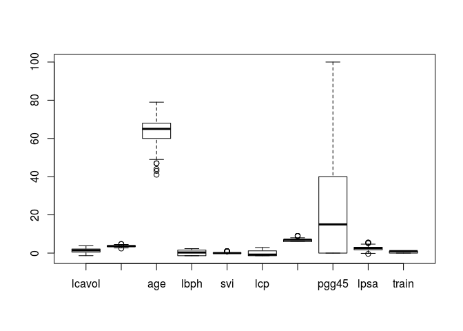

``` r
boxplot(as.list(prostate.test))
```

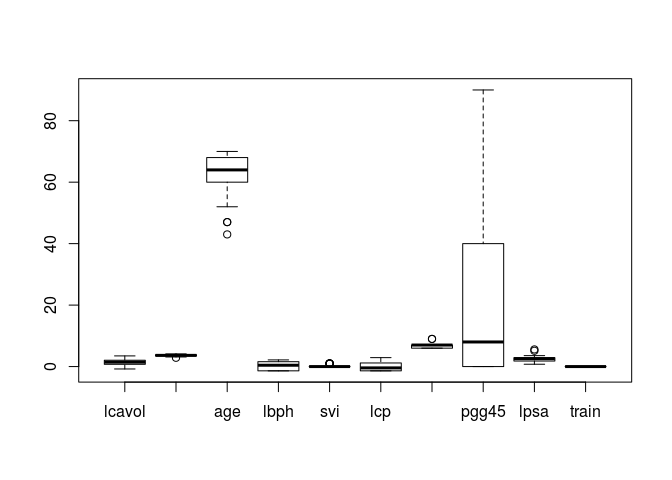

``` r
boxplot(as.list(prostate.train))
```

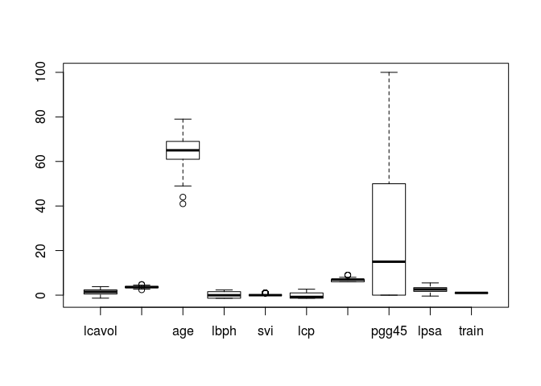

## 2 Plot the corresponding scatterplot matrix, including a linear regression within each panel, and comment on the relationships among the variables and other features of interest.

``` r
prostate.train.exclude <- subset(prostate.train, select = -c(train) )
prostate.train.exculde.cor <- cor(prostate.train.exclude)

pairs(lpsa ~ . ,  
      panel= function(x,y,...){
        points(x,y ,...)
        abline(lm(y~x) , col="grey")
        
      }, pch = ".", cex = 2, data = prostate.train.exclude)
```

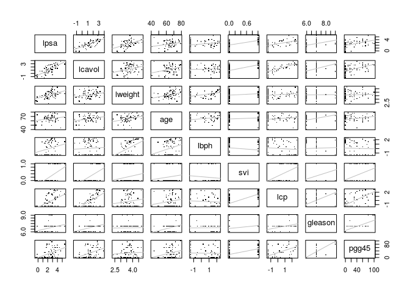

``` r
prostat.train.exclude.lm <- lm(lpsa ~ .,data=prostate.train.exclude)
```

By looking at the figure we can conculde that lpsa is almost independant of gleason and svi.

## 3 Fit the linear regression model on the training dataset with `lpsa` as the response to all input variables. Test that the regression coefficients are 0. Discuss in terms of the *p*-values for the individual input variables.

``` r
prostate.t.e.lm <- lm(lpsa ~ lcavol + lweight+ age +  lbph + svi +lcp + gleason + pgg45 , data=prostate.train.exclude)

prostate.t.e.lm$coefficients
```

    ##  (Intercept)       lcavol      lweight          age         lbph 
    ##  0.429170133  0.576543185  0.614020004 -0.019001022  0.144848082 
    ##          svi          lcp      gleason        pgg45 
    ##  0.737208645 -0.206324227 -0.029502884  0.009465162

``` r
prostate.train.summary <- summary(prostate.t.e.lm)
prostate.train.summary$coefficients
```

    ##                 Estimate Std. Error    t value     Pr(>|t|)
    ## (Intercept)  0.429170133 1.55358810  0.2762445 7.833423e-01
    ## lcavol       0.576543185 0.10743794  5.3662905 1.469415e-06
    ## lweight      0.614020004 0.22321593  2.7507894 7.917895e-03
    ## age         -0.019001022 0.01361193 -1.3959090 1.680626e-01
    ## lbph         0.144848082 0.07045669  2.0558456 4.430784e-02
    ## svi          0.737208645 0.29855507  2.4692552 1.650539e-02
    ## lcp         -0.206324227 0.11051627 -1.8669126 6.697085e-02
    ## gleason     -0.029502884 0.20113609 -0.1466812 8.838923e-01
    ## pgg45        0.009465162 0.00544651  1.7378397 8.754628e-02

``` r
glmModel <- predict(prostate.t.e.lm, newdata = prostate.train.exclude)

prostate.train.summary$sigma
```
    ## [1] 0.7122861

``` r
prostate.train.summary$r.squared
```

    ## [1] 0.6943712

``` r
pvalue <- vector(mode="character", length=10)

for (i in 0:9) {
(prostate.train.exclude.sme <- prostate.train.summary$sigma * sqrt(prostate.train.summary$cov.unscaled[i,i]))
(t <- prostate.t.e.lm$coefficients[i]/prostate.train.exclude.sme)
pvalue[i] <- 2 * (1 - pt(t, prostate.t.e.lm$df.residual)) ; 
}
prostate.train.summary
```

    ## 
    ## Call:
    ## lm(formula = lpsa ~ lcavol + lweight + age + lbph + svi + lcp + 
    ##     gleason + pgg45, data = prostate.train.exclude)
    ## 
    ## Residuals:
    ##      Min       1Q   Median       3Q      Max 
    ## -1.64870 -0.34147 -0.05424  0.44941  1.48675 
    ## 
    ## Coefficients:
    ##              Estimate Std. Error t value Pr(>|t|)    
    ## (Intercept)  0.429170   1.553588   0.276  0.78334    
    ## lcavol       0.576543   0.107438   5.366 1.47e-06 ***
    ## lweight      0.614020   0.223216   2.751  0.00792 ** 
    ## age         -0.019001   0.013612  -1.396  0.16806    
    ## lbph         0.144848   0.070457   2.056  0.04431 *  
    ## svi          0.737209   0.298555   2.469  0.01651 *  
    ## lcp         -0.206324   0.110516  -1.867  0.06697 .  
    ## gleason     -0.029503   0.201136  -0.147  0.88389    
    ## pgg45        0.009465   0.005447   1.738  0.08755 .  
    ## ---
    ## Signif. codes:  0 '***' 0.001 '**' 0.01 '*' 0.05 '.' 0.1 ' ' 1
    ## 
    ## Residual standard error: 0.7123 on 58 degrees of freedom
    ## Multiple R-squared:  0.6944, Adjusted R-squared:  0.6522 
    ## F-statistic: 16.47 on 8 and 58 DF,  p-value: 2.042e-12

``` r
coef(prostate.train.summary)
```

    ##                 Estimate Std. Error    t value     Pr(>|t|)
    ## (Intercept)  0.429170133 1.55358810  0.2762445 7.833423e-01
    ## lcavol       0.576543185 0.10743794  5.3662905 1.469415e-06
    ## lweight      0.614020004 0.22321593  2.7507894 7.917895e-03
    ## age         -0.019001022 0.01361193 -1.3959090 1.680626e-01
    ## lbph         0.144848082 0.07045669  2.0558456 4.430784e-02
    ## svi          0.737208645 0.29855507  2.4692552 1.650539e-02
    ## lcp         -0.206324227 0.11051627 -1.8669126 6.697085e-02
    ## gleason     -0.029502884 0.20113609 -0.1466812 8.838923e-01
    ## pgg45        0.009465162 0.00544651  1.7378397 8.754628e-02

The p-value for each term tests the null hypothesis that the coefficient is equal to zero (no effect). A low p-value (&lt; 0.05) indicates that you can reject the null hypothesis. In other words, a predictor that has a low p-value is likely to be a meaningful addition to your model because changes in the predictor's value are related to changes in the response variable. Conversely, a larger (insignificant) p-value suggests that changes in the predictor are not associated with changes in the response. So here the lcavol and lweight are the two most important factors on the output because they have very small p-values. Here It was a little bit confusing for me because 3 out of 9 p-values calculated by my formula are slightly different with the pvalues calculated by summary.

## 4 Compute the `mean squared error` evaluation metric on the test dataset and compare it to the corresponding metric on the training dataset. Discuss.

``` r
y.pred.train <- predict(prostate.t.e.lm, newdata=prostate.train.exclude, type="response")
#y.pred.train <- round(y.pred.train)
mean.rsquared.train <- mean((y.pred.train-prostate.train$lpsa)^2)  
mean.rsquared.train
```

    ## [1] 0.4391998

``` r
y.pred.test <- predict(prostate.t.e.lm, newdata=prostate.test.exclude, type="response")
#y.pred.test <- round(y.pred.test)
mean.rsquared.test <- mean((y.pred.test-prostate.test$lpsa)^2)
mean.rsquared.test
```

    ## [1] 0.521274

The results shows that the mean R-Squared for the training data is smaller than the test data which we would have expected since the training dataset was originally used to fit the data so it should have lesser amount or R-squared than testing data set.

## 5 Perform residual regression diagnostics, including plots, on the model in 3 to determine if deficiencies are present in the model, including outliers. Discuss.

``` r
plot(prostate.t.e.lm$fit, prostate.t.e.lm$res, xlab="Predicted lpsa", ylab="Residual lpsa")
abline(h=0)
```


``` r
jackres <- rstudent(prostate.t.e.lm) # The jacknifed residuals

order(jackres)
```

    ##  [1] 34 28  7  5  1  2 19 14 10  4  3 36 11 21 20 12 37 17 16 23 43  8 47
    ## [24] 52 44 61 51 50 42 40 33 58 49 46 22 64  6 24 32 13 56 35 53 30 31 66
    ## [47]  9 41 15 38 39 59 29 65 18 63 26 62 55 48 60 57 25 67 27 54 45

``` r
jackres[c(34,28,45)]
```

    ##        47        39        69 
    ## -2.576211 -2.568988  2.425350

``` r
prostate.t.e.lm$df.residual
```

    ## [1] 58

``` r
plot(jackres, ylab="Jacknife residuals")
abline(h=0)
```

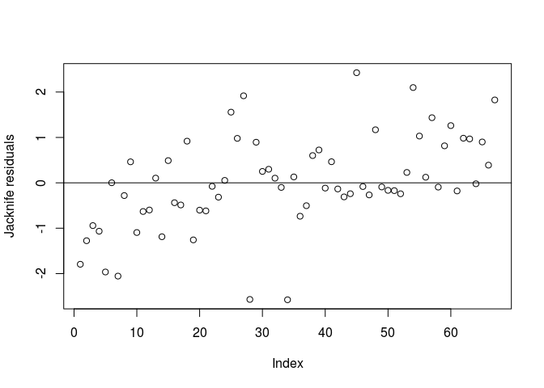

``` r
prostate.train[34,]
```

    ##      lcavol  lweight age     lbph svi      lcp gleason pgg45     lpsa
    ## 47 2.727853 3.995445  79 1.879465   1 2.656757       9   100 2.568788
    ##    train
    ## 47  TRUE

``` r
prostate.train.exclude[34,]$lpsa
```

    ## [1] 2.568788

``` r
qt(0.05/2, 58)
```

    ## [1] -2.001717

``` r
qt(0.05/(2*67), 58)
```

    ## [1] -3.560793

``` r
prostate.train.exclude[28,]$lpsa
```

    ## [1] 2.213754

``` r
prostate.train[28,]
```

    ##      lcavol  lweight age     lbph svi      lcp gleason pgg45     lpsa
    ## 39 2.660959 4.085136  68 1.373716   1 1.832581       7    35 2.213754
    ##    train
    ## 39  TRUE

``` r
jackres[28]
```

    ##        39 
    ## -2.568988

``` r
qt(0.05/2, 58)
```

    ## [1] -2.001717

``` r
qt(0.05/(2*67), 58)
```

    ## [1] -3.560793

``` r
prostate.train[45,]
```

    ##        lcavol  lweight age      lbph svi       lcp gleason pgg45     lpsa
    ## 69 -0.4462871 4.408547  69 -1.386294   0 -1.386294       6     0 2.962692
    ##    train
    ## 69  TRUE

``` r
prostate.train.exclude[45,]$lpsa
```

    ## [1] 2.962692

``` r
jackres[45]
```

    ##      69 
    ## 2.42535

``` r
qt(0.05/2, 58)
```

    ## [1] -2.001717

``` r
qt(0.05/(2*67), 58)
```

    ## [1] -3.560793

The residuals and Jacknifed residuals should be compared to say if those extreme points are outlier or not. Here it seems that they are close so these are not outlier I think!

## 6 Perform a subset selection of the input variables in the training dataset using the R function `step`. What is your final model? Discuss the proposed final (reduced) model.

``` r
prostate.step <- step(prostate.t.e.lm); # gleason is eliminated by step function
```

    ## Start:  AIC=-37.13
    ## lpsa ~ lcavol + lweight + age + lbph + svi + lcp + gleason + 
    ##     pgg45
    ## 
    ##           Df Sum of Sq    RSS     AIC
    ## - gleason  1    0.0109 29.437 -39.103
    ## <none>                 29.426 -37.128
    ## - age      1    0.9886 30.415 -36.914
    ## - pgg45    1    1.5322 30.959 -35.727
    ## - lcp      1    1.7683 31.195 -35.218
    ## - lbph     1    2.1443 31.571 -34.415
    ## - svi      1    3.0934 32.520 -32.430
    ## - lweight  1    3.8390 33.265 -30.912
    ## - lcavol   1   14.6102 44.037 -12.118
    ## 
    ## Step:  AIC=-39.1
    ## lpsa ~ lcavol + lweight + age + lbph + svi + lcp + pgg45
    ## 
    ##           Df Sum of Sq    RSS     AIC
    ## <none>                 29.437 -39.103
    ## - age      1    1.1025 30.540 -38.639
    ## - lcp      1    1.7583 31.196 -37.216
    ## - lbph     1    2.1354 31.573 -36.411
    ## - pgg45    1    2.3755 31.813 -35.903
    ## - svi      1    3.1665 32.604 -34.258
    ## - lweight  1    4.0048 33.442 -32.557
    ## - lcavol   1   14.8873 44.325 -13.681

``` r
prostate.step.lm <- lm(lpsa ~ lcavol + lweight + age + lbph + svi + lcp + pgg45)

summary(prostat.train.exclude.lm)
```

    ## 
    ## Call:
    ## lm(formula = lpsa ~ ., data = prostate.train.exclude)
    ## 
    ## Residuals:
    ##      Min       1Q   Median       3Q      Max 
    ## -1.64870 -0.34147 -0.05424  0.44941  1.48675 
    ## 
    ## Coefficients:
    ##              Estimate Std. Error t value Pr(>|t|)    
    ## (Intercept)  0.429170   1.553588   0.276  0.78334    
    ## lcavol       0.576543   0.107438   5.366 1.47e-06 ***
    ## lweight      0.614020   0.223216   2.751  0.00792 ** 
    ## age         -0.019001   0.013612  -1.396  0.16806    
    ## lbph         0.144848   0.070457   2.056  0.04431 *  
    ## svi          0.737209   0.298555   2.469  0.01651 *  
    ## lcp         -0.206324   0.110516  -1.867  0.06697 .  
    ## gleason     -0.029503   0.201136  -0.147  0.88389    
    ## pgg45        0.009465   0.005447   1.738  0.08755 .  
    ## ---
    ## Signif. codes:  0 '***' 0.001 '**' 0.01 '*' 0.05 '.' 0.1 ' ' 1
    ## 
    ## Residual standard error: 0.7123 on 58 degrees of freedom
    ## Multiple R-squared:  0.6944, Adjusted R-squared:  0.6522 
    ## F-statistic: 16.47 on 8 and 58 DF,  p-value: 2.042e-12

``` r
summary(prostate.step.lm)
```

    ## 
    ## Call:
    ## lm(formula = lpsa ~ lcavol + lweight + age + lbph + svi + lcp + 
    ##     pgg45)
    ## 
    ## Residuals:
    ##      Min       1Q   Median       3Q      Max 
    ## -1.76395 -0.35764 -0.02143  0.37762  1.58178 
    ## 
    ## Coefficients:
    ##              Estimate Std. Error t value Pr(>|t|)    
    ## (Intercept)  0.494155   0.873567   0.566  0.57304    
    ## lcavol       0.569546   0.085847   6.634 2.46e-09 ***
    ## lweight      0.614420   0.198449   3.096  0.00262 ** 
    ## age         -0.020913   0.010978  -1.905  0.06000 .  
    ## lbph         0.097353   0.057584   1.691  0.09441 .  
    ## svi          0.752397   0.238180   3.159  0.00216 ** 
    ## lcp         -0.104959   0.089347  -1.175  0.24323    
    ## pgg45        0.005324   0.003385   1.573  0.11923    
    ## ---
    ## Signif. codes:  0 '***' 0.001 '**' 0.01 '*' 0.05 '.' 0.1 ' ' 1
    ## 
    ## Residual standard error: 0.696 on 89 degrees of freedom
    ## Multiple R-squared:  0.663,  Adjusted R-squared:  0.6365 
    ## F-statistic: 25.01 on 7 and 89 DF,  p-value: < 2.2e-16

``` r
# gleason is eliminated from the model. r-squared are now smaller as well as p-value. 
```

## 7 For the reduced model compute the `mean squared error` evaluation metric on the test dataset and compare it to the corresponding metric on the training dataset. Discuss.

``` r
y.pred.train <- predict(prostate.step.lm, newdata=prostate.train.exclude, type="response")
mean.rsquared.train <- mean((y.pred.train-prostate.train$lpsa)^2)  
y.pred.train

y.pred.test <- predict(prostate.step.lm, newdata=prostate.test.exclude, type="response")
#y.pred.test <- round(y.pred.test)
mean.rsquared.test <- mean((y.pred.test-prostate.test$lpsa)^2)

summary(prostate.t.e.lm)
```

    ## 
    ## Call:
    ## lm(formula = lpsa ~ lcavol + lweight + age + lbph + svi + lcp + 
    ##     gleason + pgg45, data = prostate.train.exclude)
    ## 
    ## Residuals:
    ##      Min       1Q   Median       3Q      Max 
    ## -1.64870 -0.34147 -0.05424  0.44941  1.48675 
    ## 
    ## Coefficients:
    ##              Estimate Std. Error t value Pr(>|t|)    
    ## (Intercept)  0.429170   1.553588   0.276  0.78334    
    ## lcavol       0.576543   0.107438   5.366 1.47e-06 ***
    ## lweight      0.614020   0.223216   2.751  0.00792 ** 
    ## age         -0.019001   0.013612  -1.396  0.16806    
    ## lbph         0.144848   0.070457   2.056  0.04431 *  
    ## svi          0.737209   0.298555   2.469  0.01651 *  
    ## lcp         -0.206324   0.110516  -1.867  0.06697 .  
    ## gleason     -0.029503   0.201136  -0.147  0.88389    
    ## pgg45        0.009465   0.005447   1.738  0.08755 .  
    ## ---
    ## Signif. codes:  0 '***' 0.001 '**' 0.01 '*' 0.05 '.' 0.1 ' ' 1
    ## 
    ## Residual standard error: 0.7123 on 58 degrees of freedom
    ## Multiple R-squared:  0.6944, Adjusted R-squared:  0.6522 
    ## F-statistic: 16.47 on 8 and 58 DF,  p-value: 2.042e-12

``` r
r-squared for the test data is smaller than the r-squared of training data but they are almost close to each other thus we are not overfitting.
```

## 8 Perform residual regression diagnostics, including plots, on the reduced model in 6 to determine if deficiencies are present in the model. Is the final model reasonable? Discuss.

``` r
plot(prostate.t.e.lm$fit, prostate.t.e.lm$res, xlab="Predicted lpsa", ylab="Residual lpsa")
abline(h=0)
```

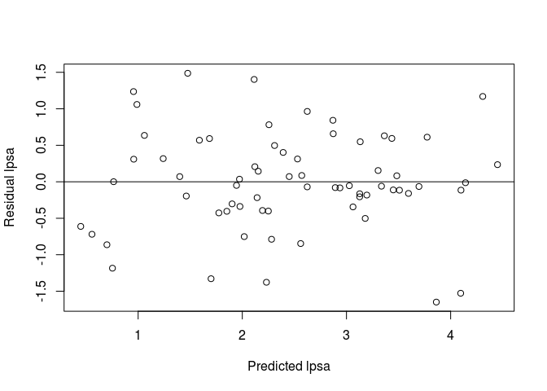

``` r
jackres <- rstudent(prostate.t.e.lm) # The jacknifed residuals
plot(prostate.step.lm$fit, prostate.step.lm$res, xlab="Predicted lpsa", ylab="Residual lpsa")
abline(h=0)
```

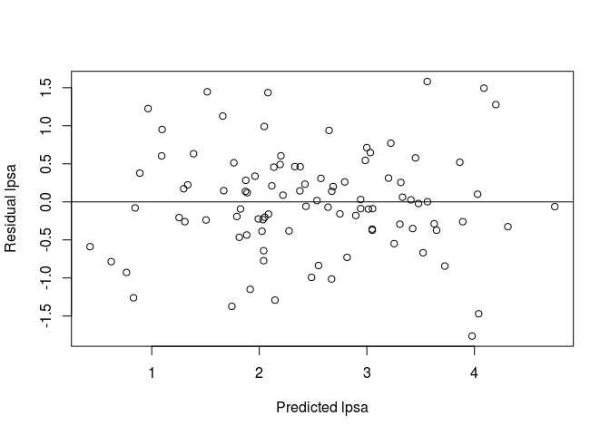

``` r
jackres <- rstudent(prostate.step.lm) # The jacknifed residuals

plot(jackres, ylab="Jacknife residuals")
abline(h=0)
```

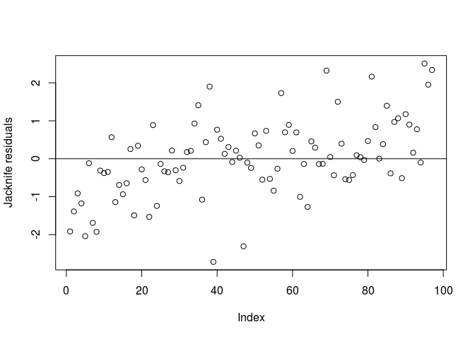 From the plot it seems that the outliers are now elimiating from the plot.

## 9 Cross validate your reduced model on the training data using 10-fold and leave-one-out CV from the package `boot`.

``` r
library(boot)
library(ElemStatLearn)
#attach(prostate)

prostate.train.exclude2 <- subset(prostate.train, select = -c(gleason ) )
prostate.test.exclude2 <- subset(prostate.test, select = -c(gleason ) )

prostate.glm <- glm(lpsa ~ lcavol + lweight + age + lbph + svi + lcp + pgg45, data=prostate.train.exclude2)
cv.glm(prostate.train.exclude2, prostate.glm)$delta
```

    ## [1] 0.5636655 0.5626683

``` r
set.seed(123)
prostate.glm2 <- glm(lpsa ~ lcavol + lweight + age + lbph + svi + lcp + pgg45, data=prostate.train.exclude2)
cv.glm(prostate.train.exclude2, prostate.glm2, K=10)$delta
```

    ## [1] 0.5476330 0.5414358

## 10 Run regularized regressions (ridge and lasso) on the full model for the training data. Discuss the results in comparison with the full model above.

``` r
prostate.x <- model.matrix( lpsa ~ ., prostate)[, -9]
prostate.y <- prostate$lpsa

# The least square fit
prostate.ls <- glmnet(prostate.x, prostate.y, alpha=0, lambda=0)
coef(prostate.ls)
```

    ## 9 x 1 sparse Matrix of class "dgCMatrix"
    ##                      s0
    ## (Intercept)  0.02398254
    ## (Intercept)  .         
    ## lcavol       0.57467019
    ## lweight      0.45265809
    ## age         -0.01811640
    ## lbph         0.10882450
    ## svi          0.79724753
    ## lcp         -0.07474256
    ## gleason      0.14591010

``` r
predict(prostate.ls, prostate.x[1:10,])
```

    ##           s0
    ## 1  0.8668076
    ## 2  0.7327209
    ## 3  0.5821293
    ## 4  0.5955430
    ## 5  1.7144988
    ## 6  0.8046164
    ## 7  1.9064901
    ## 8  2.1200702
    ## 9  1.1566600
    ## 10 1.3077455

``` r
prostate.ridge <- glmnet(prostate.x, prostate.y, alpha=0, nlambda=20)
print(prostate.ridge)
```

    ## 
    ## Call:  glmnet(x = prostate.x, y = prostate.y, alpha = 0, nlambda = 20) 
    ## 
    ##       Df      %Dev    Lambda
    ##  [1,]  7 2.998e-36 843.40000
    ##  [2,]  7 6.504e-03 519.40000
    ##  [3,]  7 1.051e-02 319.90000
    ##  [4,]  7 1.691e-02 197.00000
    ##  [5,]  7 2.708e-02 121.30000
    ##  [6,]  7 4.299e-02  74.72000
    ##  [7,]  7 6.738e-02  46.01000
    ##  [8,]  7 1.035e-01  28.34000
    ##  [9,]  7 1.544e-01  17.45000
    ## [10,]  7 2.211e-01  10.75000
    ## [11,]  7 3.003e-01   6.61900
    ## [12,]  7 3.836e-01   4.07600
    ## [13,]  7 4.602e-01   2.51000
    ## [14,]  7 5.223e-01   1.54600
    ## [15,]  7 5.681e-01   0.95210
    ## [16,]  7 5.999e-01   0.58630
    ## [17,]  7 6.212e-01   0.36110
    ## [18,]  7 6.346e-01   0.22240
    ## [19,]  7 6.426e-01   0.13700
    ## [20,]  7 6.469e-01   0.08434

``` r
# Here we can see when the lamda increases the coefficients goes to zero so we do variable selection
plot(prostate.ridge, xvar="lambda", label=TRUE)
```

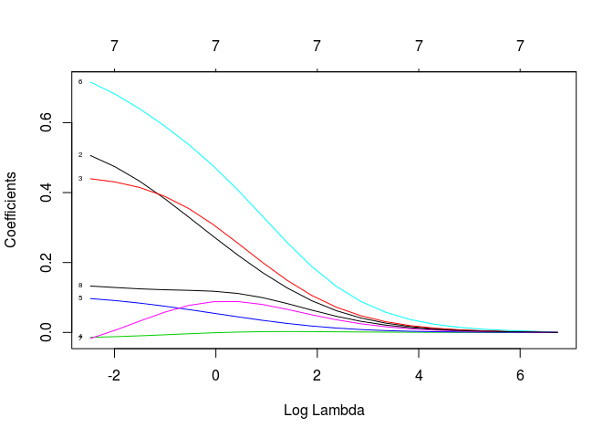

``` r
plot(prostate.ridge, xvar="dev", label=TRUE)
```

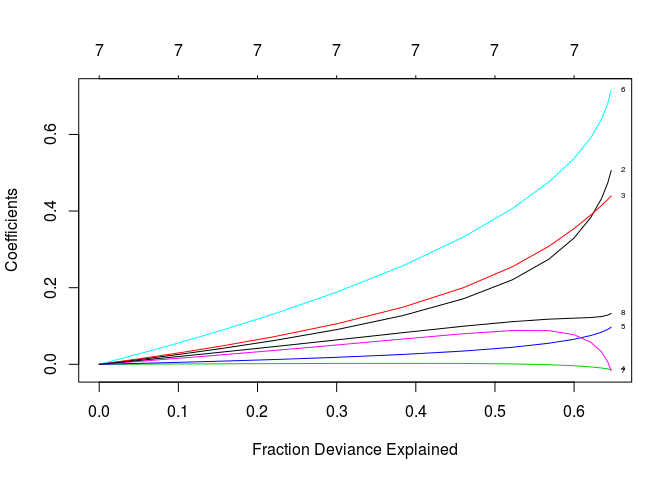

``` r
set.seed(1)
prostate.cv0 <- cv.glmnet(prostate.x, prostate.y, type.measure="mae", nfolds=10, alpha=0)
This is minumum of lambda in ridge regression ( alpha =0 )
prostate.cv0$lambda.min
```

    ## [1] 0.09256602

``` r
Here we see that the coeffiencts are close to zero but not exactly zero ( actually in the lasso the regression tends to go zero and here they will go close to each other)
coef(prostate.cv0, s="lambda.min")
```

    ## 9 x 1 sparse Matrix of class "dgCMatrix"
    ##                       1
    ## (Intercept)  0.02227818
    ## (Intercept)  .         
    ## lcavol       0.50043571
    ## lweight      0.43828287
    ## age         -0.01372783
    ## lbph         0.09582781
    ## svi          0.71004174
    ## lcp         -0.01291019
    ## gleason      0.13190421

``` r
Comparing the optimal ridge regression with corresponding regression coefficients and  predicted values in the following
predict(prostate.cv0, newx = prostate.x[1:10,], s = "lambda.min")
```

    ##            1
    ## 1  0.9360262
    ## 2  0.8599055
    ## 3  0.7386715
    ## 4  0.7388251
    ## 5  1.7280273
    ## 6  0.9021230
    ## 7  1.9032503
    ## 8  2.0808390
    ## 9  1.2162467
    ## 10 1.3675797

``` r
prostate.lasso <- glmnet(prostate.x, prostate.y, alpha=1, nlambda=20)
print(prostate.lasso)
```

    ## 
    ## Call:  glmnet(x = prostate.x, y = prostate.y, alpha = 1, nlambda = 20) 
    ## 
    ##       Df   %Dev    Lambda
    ##  [1,]  0 0.0000 0.8434000
    ##  [2,]  1 0.3348 0.5194000
    ##  [3,]  2 0.4795 0.3199000
    ##  [4,]  3 0.5685 0.1970000
    ##  [5,]  4 0.6081 0.1213000
    ##  [6,]  5 0.6262 0.0747200
    ##  [7,]  6 0.6369 0.0460100
    ##  [8,]  6 0.6436 0.0283400
    ##  [9,]  7 0.6462 0.0174500
    ## [10,]  7 0.6490 0.0107500
    ## [11,]  7 0.6500 0.0066190
    ## [12,]  7 0.6504 0.0040760
    ## [13,]  7 0.6506 0.0025100
    ## [14,]  7 0.6506 0.0015460
    ## [15,]  7 0.6506 0.0009521
    ## [16,]  7 0.6506 0.0005863
    ## [17,]  7 0.6506 0.0003611

``` r
# we see that the variables go to zero for large lambda
plot(prostate.lasso, xvar="lambda", label=TRUE)
```

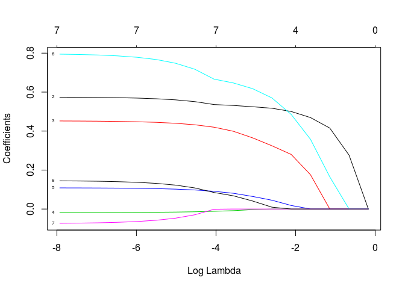

``` r
plot(prostate.lasso, xvar="dev", label=TRUE)
```

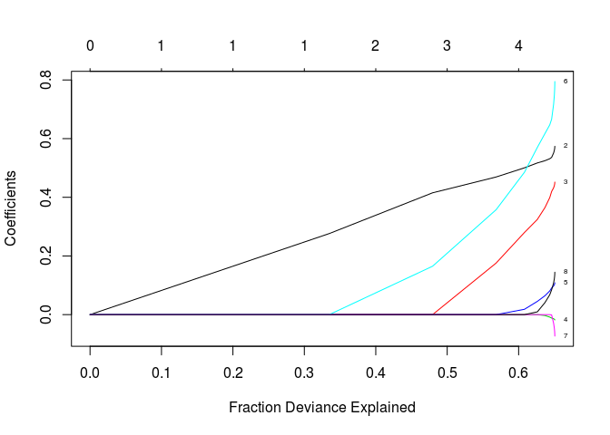

``` r
prostate.cv1 <- cv.glmnet(prostate.x, prostate.y, type.measure="mae", nfolds=10, alpha=1)
prostate.cv1$lambda.min
```

    ## [1] 0.001817109

``` r
coef(prostate.cv1, s="lambda.min")
```

    ## 9 x 1 sparse Matrix of class "dgCMatrix"
    ##                       1
    ## (Intercept)  0.04790346
    ## (Intercept)  .         
    ## lcavol       0.57071814
    ## lweight      0.44917173
    ## age         -0.01745053
    ## lbph         0.10695739
    ## svi          0.78366601
    ## lcp         -0.06702467
    ## gleason      0.13941406

``` r
predict(prostate.cv1, newx = prostate.x[1:5,], s = "lambda.min")
```

    ##           1
    ## 1 0.8695706
    ## 2 0.7405308
    ## 3 0.5943772
    ## 4 0.6043100
    ## 5 1.7176799

``` r
In the above question the step function elimiate the gleason but here it is different. in the lasso "age" is very close to zero and in the ridge "lcp" and then "age".
y.pred.train <- predict(prostate.t.e.lm, newdata=prostate.train.exclude, type="response")
```
